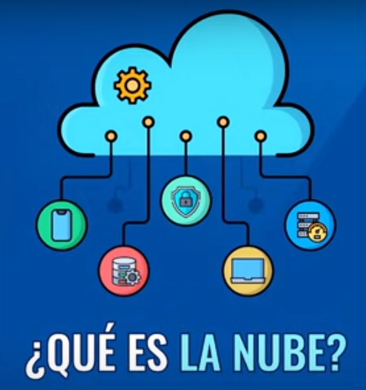

- ¿Qué es Cloud Computing?
	- Todo lo que no es local
- ¿Qué es la nube?
	- La computadora de alguien más
- {:height 395, :width 266}
- Unidad 1 · Objetivos
	- 1. Infraestructuras como un Servicio.
	  2. Ventajas, enfoques y modelos.
	  3. Hypervisor y teoría de la virtualización.
	  4. Virtual Private Cloud.
	  5. Datacenters, regiones y zonas de
	  disponibilidad.
	  6. Backend y Frontend.
	  7. Imágenes
	  8. Aprovisionamiento de storage.
	  9. IP estática y flotante.
	  10. Domain Name System, DNS.
	  11. Firewall.
	  12. Balanceo de cargas.
	  13. Escalado.
	  14. Práctico: implementación de infraestructura.
-